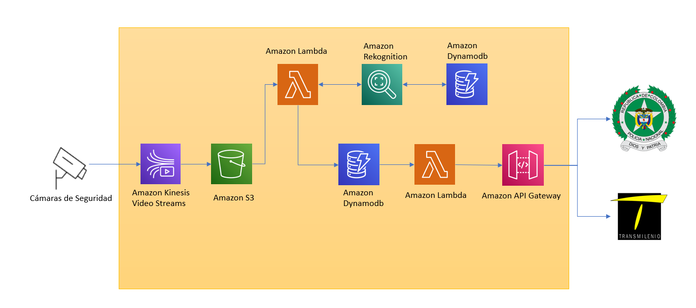
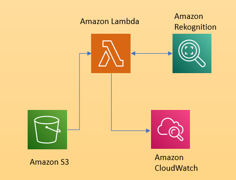
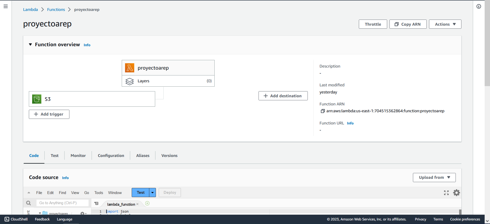
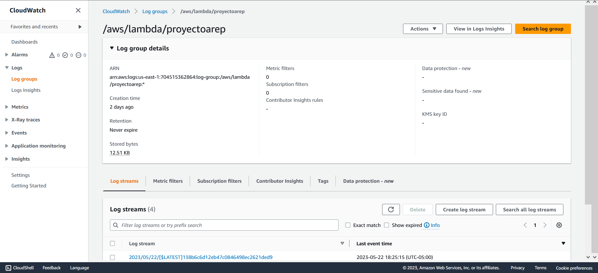

# Reconocimiento facial de delincuentes con ayuda de las cámaras de seguridad en Bogotá

## Descripción del problema

En la ciudad de Bogotá se han presentado innumerables casos de inseguridad en los últimos años, por lo que se requiere de un sistema que permita identificar a los delincuentes, para así poder capturarlos y evitar que sigan cometiendo delitos.

## Descripción de la solución

Para solucionar el problema, se propone un sistema de reconocimiento facial que permita identificar a los delincuentes que se encuentran en la ciudad mediante las imágenes de las cámaras de seguridad, las cuales se compararán con una base de datos de delincuentes, para así poder identificar de manera rapida y eficiente a los delincuentes.

## Descripción de la arquitectura

Para la solución del problema, se propone una arquitectura basada en microservicios, en la cual se tendrán los siguientes componentes:

La solución funcionará de la siguiente manera: 
Por medio de Amazon Kinesis Video Streams, que es un servicio de AWS que se usa para transmitir videos en vivo desde dispositivos locales a la nube de AWS, se extraeran los videos de las cámaras de seguridad, posteriormente con Amazon Rekognition Video se hará el análisis de los videos, este detectará los rostros de las personas y se usaran los metadatos faciales almacenados en una colección para detectar a las personas, cuando Amazon Rekognition detecte la cara en la imagen, analizará los atributos faciales de la cara y luego devolverá una puntuación de porcentaje de confianza para la cara y los atributos faciales que se detectan en la imagen. Por ultimo, se usará Amazon Kinesis Data Streams  para leer los resultados del análisis que Amazon Rekognition Video envía al flujo de datos de Kinesis.

## Prototipo

Lo que realizamos en esta parte fue construir un prototipo de la arquitectura propuesta en AWS y mediante una serie de imágenes cargadas a un Bucket, procesarlas y como resultado se obtiene el tipo de características del rostro, el genero de la persona y demás atributos. Así asimilando un poco a como seria el uso de esta tecnología en las cámaras del transmilenio y el reconocimiento facial de delincuentes en este sistema de transporte.

Para la creacion de esta arquitectura se hizo lo siguiente:

- Se creó un bucket en S3 para almacenar las imagenes que se van a procesar.

- Se creó una funcion lambda que se encarga de procesar las imagenes que se encuentran en el bucket de S3, para esto se utilizó el codigo que esta en el archivo ./src/lambda_function.py.

- En Amazon CloudWatch se creó un Log Group para almacenar los logs de la funcion lambda.

## Demo

Video de la demostración: https://youtu.be/tU5Zc9OXGa4

## Integrantes
- [Juan David Martinez](https://github.com/juanda171217)
- [Santiago Fetecua](https://github.com/santiago-f20)
